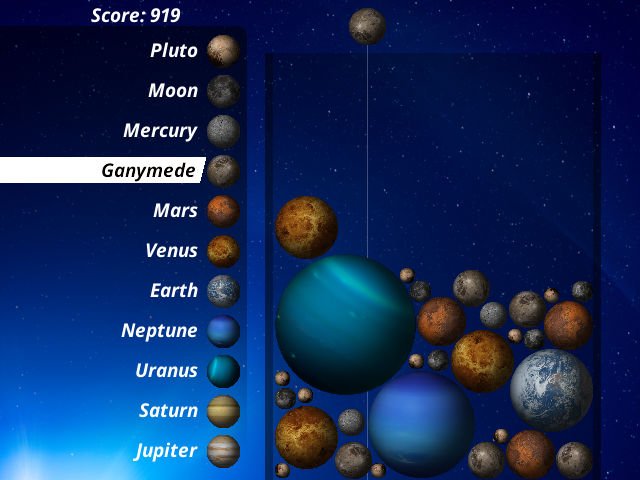

# Dinnye



Dinnye is a fruit merge game designed to run efficiently on very weak hardware, such as devices using the F1C100s SoC. This performance is achieved through the use of fixed-point math, including a highly effective [fixed-point reciprocal square root approximation](docs/rsqrt.md).

In Hungarian, *Dinnye* means watermelon — I wanted to port the Suka Game to weaker hardware. The game has since evolved, and now players merge planets rather than fruits.

# Planet Merge

Technically, players merge celestial bodies. These bodies, ordered by size, are:

1. Pluto
2. Moon
3. Mercury
4. Ganymede
5. Mars
6. Venus
7. Earth
8. Neptune
9. Uranus
10. Saturn
11. Jupiter

# Building

### Desktop

```bash
mkdir build
cd build
cmake ..
make
```

There is no packager for desktop. You can launch the game by executing `build/planets` in the repo root.
The desktop build requires the following files:

```
planets
assets/title.png
assets/background.png
assets/hi_background.jpg
assets/earth.png
assets/ganymede.png
assets/jupiter.png
assets/mars.png
assets/mercury.png
assets/moon.png
assets/neptune.png
assets/pluto.png
assets/saturn.png
assets/uranus.png
assets/venus.png
assets/sounds.dat
assets/wiggle-until-you-giggle.fda
```

You can control the game with the arrow keys, drop with space, escape brings up the menu.

### Cross compiling for other platforms

The build system uses Docker images for cross compilations set up by custom makefiles. These can be found in GitHub repositories.

Repo locations:

- RG35XX Garlic/Bittboy: https://github.com/psiroki/rg35xx-toolchain.git
- Miyoo A30: https://github.com/psiroki/gpuarmhf.git
- Miyoo Mini: https://github.com/psiroki/miyoomini-buildroot.git
- AArch64: https://github.com/psiroki/x55toolchain.git

Clone the repo in some folder, and you can create a `platforms/platforms.txt` based on this by filling out the path as
described with the angled bracket placeholders:

```
BITTBOY bb <path to cloned Bittboy toolchain git repo>
MIYOOA30 ma30 <path to cloned Miyoo A30 git repo>
MIYOO mm <path to cloned Miyoo Mini git repo>
RG35XX22 garlic <path to cloned RG35XX Garlic and Bittboy git repo>
PORTMASTER a64 <path to cloned AArch64 git repo>
```

Run `cross_build.sh` which will take care of the cross compilation, it runs through all the platforms specified in `platforms.txt`,
build, and even package those platforms that have a packer defined. Though there's only one platform specified yet: more to come later.

### Making a PortMaster build manually

From the project root:

```
# Build make the executable
mkdir -p build/platforms/a64
cd build/platforms/a64
cmake -DPORTMASTER=ON -DCMAKE_BUILD_TYPE=Release ..
make

# Create the package
cd ../../../platforms/packers/PORTMASTER-a64
make PROJECT_ROOT="../../.." BUILD_DIR="../../../build/platforms/a64"
```

If everything runs without an error the package can be found at `build/platforms/planet_merge_portmaster_a64.zip`.
