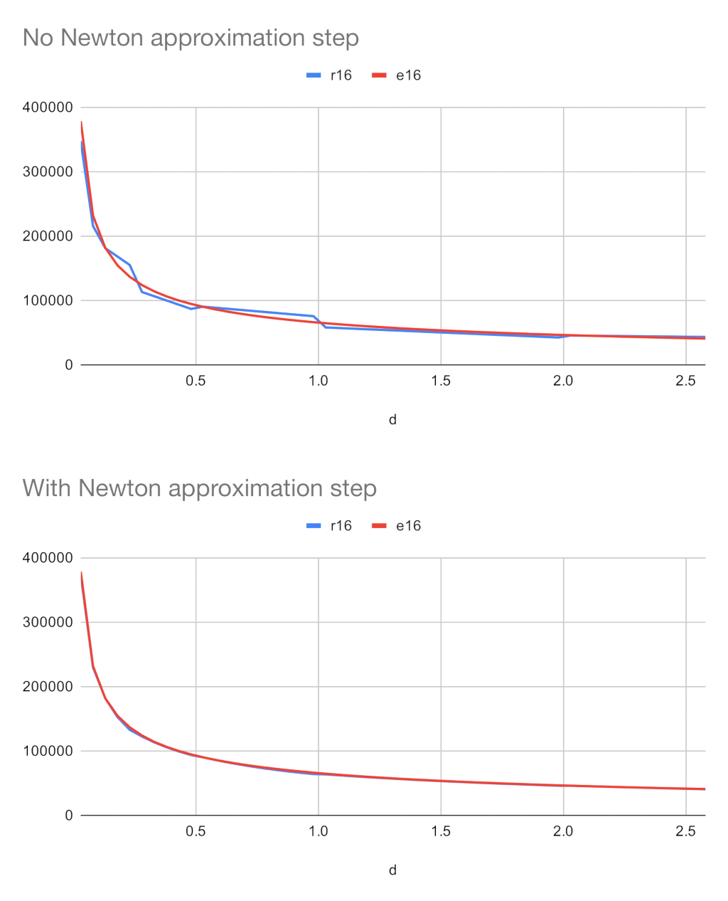

# rsqrt

The reciprocal square root function returns $\frac{1}{\sqrt{x}} = x^{-0.5}$

I want to calculate this on the F1C100s SoC fast. For that I'll have to use fixed point math (16 integer and 16 fractional bits).
It's best to start explaining it by understanding how floating point quick rsqrt works.

## IEEE float version

```C++
float Q_rsqrt( float number )
{
  long i;
  float x2, y;
  const float threehalfs = 1.5F;

  x2 = number * 0.5F;
  y  = number;
  i  = * ( long * ) &y;         // cool floating point bit level hacking to take the logarithm
  i  = 0x5f3759df - ( i >> 1 ); // divide by two, negate it and add bias
  y  = * ( float * ) &i;
  y  = y * ( threehalfs - ( x2 * y * y ) );   // Newton's method 1st iteration
//	y  = y * ( threehalfs - ( x2 * y * y ) );   // 2nd iteration, this can be removed

  return y;
}
```

If we take the base-2 logarithm of $x$, it's essentially just a negation and a division before we convert it back: $-\frac{1}{2} \log_2 x$.

This is effective, but now I need to quickly calculate the logarithm of a floating-point number.
This can be done efficiently if we understand how floating-point numbers are represented:
- The highest bit is the sign bit. Since we assume $x$ is always valid, this is 0 (indicating positive).
- This is followed by 8 exponent bits (we'll call this $c$ in formulas, since $e$ could be ambigious)
- Finally, there are 23 mantissa bits (treated as a 23-bit integer, denoted as $m$)

The real value of a positive float $x$ is then represented as: $x = 2^{c-128}(1+m \cdot 2^{-23})$

The logarithm of this is $\log_2 x = c + \log_2(1 + m \cdot 2^{-23})$. The second logarithmic term will yield a value between 0 and 1,
as its parameter is between 1 and 2. To approximate, we can simplify this as: $\log_2 x \approx c + m \cdot 2^{-23}$ (using the approximation $\log_2 y \approx y - 1$ for $1 \le y \le 2$).

Mapping the float bits to a 32-bit integer gives this approximation, except it also scales it by $2^{23}$, However, this is acceptable, as mapping it back will also divide it by $2^{23}$.

So we shift it right one bit (effectively dividing by two), negate it, and add a bias to adjust both for the IEEE exponent bias and to minimize the average error.

Mapping the integer back to a float effectively performs an approximate inverse logarithmic operation. We then apply a Newton's method iteration to further refine the precision.

## Fixed point version

```C++
Fixed rsqrt(Fixed f) {
  uint32_t n = f.f;
  if (!n) return f;
  int bits = 32 - __builtin_clz(n);
  int newBits = 16-((bits-16) >> 1); // 1.
  uint32_t y = ((n-(1 << bits-1))>>1)+((bits&1^1) << bits-1); // 2.
  y ^= (1 << (bits - 1)) - 1; // 3.
  if (newBits > bits) { // 4.
    y <<= newBits - bits;
  } else if (newBits < bits) {
    y >>= bits - newBits;
  }
  y += (1 << newBits); // 5.
  y -= 0x4dbfab13 >> (31-newBits); // 6.
  Fixed result = Fixed::fromRaw(y);
  return result * (3 - f*result*result) >> 1;  // 7.
}
```

Here, the `Fixed` class provides functionality for fixed-point arithmetic,
specifically using 16 fractional bits. For example, in this format,
1 is represented by 65536, and 0.5 is represented by 32768.
The raw bits are accessible via the field `int32_t f`.

The `__builtin_clz(n)` counts the number of leading zeros. For example, if the number is represented by 10 bits in binary, it would return 22, because there are 22 leading zero bits.
This effectively used to calculate the exponent.

Explanation of each step:

1. `newBits` will store the final exponent, the difference between `bits` and `newBits` will tell how much to shift the result.
2. We approximate the mantissa's logarithm. First, we remove the highest bit with `n-(1 << bits-1)`, then divide by two using a shift (`>>1`). Since the exponent can be odd, we approximate it by adding it as the highest-order bit.
3. To negate, we flip all the bits except the highest one: `y ^= (1 << (bits - 1)) - 1`.
4. Apply the new exponent by shifting left or right as needed.
5. Add back the highest-order bit, which essentially reverses the logarithmic operation.
6. Apply the bias. The bias value was derived empirically to minimize average relative error across a range of inputs. It must be shifted due to the fixed-point scaling as it is for the mantissa.
7. Perform one iteration of Newton's method for refinement.

This completes the implementation.

Here's how well it performs without or with the Newton iteration. You can see it's a pretty good approximation despite how simple it is to compute, and after the Newton iteration, it's almost perfect:


